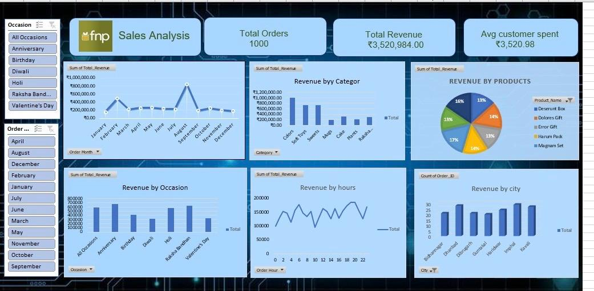

 
Sales & Revenue Analysis Dashboard (Excel)

##  Project Overview

This project presents an interactive **Sales & Revenue Analysis Dashboard** built using Microsoft Excel.  
The dashboard provides business insights into sales performance, customer purchasing behavior, occasion-based demand, and geographic trends for Ferns & Petals.

The objective of this project is to transform raw sales data into actionable insights for business decision-making.

---

## Business Problem

Retail businesses often struggle to:
- Identify high-performing products and categories
- Understand seasonal demand patterns
- Analyze revenue contribution by city or occasion
- Monitor overall sales performance efficiently

This dashboard addresses these challenges by providing a centralized analytical view of sales metrics.

---

## 📈 Key Performance Indicators (KPIs)

- **Total Orders**
- **Total Revenue**
- **Average Order Value**
- **Monthly Revenue Trends**
- **Revenue by Product Category**
- **Revenue by Occasion**
- **City-wise Sales Distribution**

---

## 🔍 Key Insights

- Sales show strong seasonal spikes during specific occasions.
- Certain product categories contribute significantly higher revenue.
- Revenue concentration is higher in select cities, indicating geographic demand variations.
- Occasion-based purchasing behavior impacts overall sales performance.

📌 These insights can help businesses optimize inventory, marketing campaigns, and regional targeting strategies.

---

## 🛠 Tools & Techniques Used

- Microsoft Excel
- Pivot Tables
- Pivot Charts
- Slicers for interactivity
- Data Cleaning & Aggregation
- KPI Calculation using Excel formulas

---

## 📂 Repository Structure

- `Sales & Revenue Analysis Dashboard.xlsx` – Interactive Excel dashboard  
- `Dashboard_screenshot.jpeg` – Dashboard preview image  
- `Ferns and Petals Sales Analysis.pdf` – Detailed business analysis report  
- `Dashboard Analysis Summary.pdf` – Additional insights documentation  

---

## 🖼 Dashboard Preview

---

## 🚀 How to Use

1. Download the Excel file.
2. Open in Microsoft Excel (recommended 2016 or later).
3. Use slicers to filter by:
   - Product Category
   - Occasion
   - City
   - Time Period
4. Analyze KPIs and visual trends dynamically.

---

## 💼 Skills Demonstrated

- Data Analysis
- Business Intelligence Reporting
- Data Visualization
- Dashboard Design
- Insight Generation
- Analytical Thinking

---

## 📌 Future Improvements

- Add Profit & Margin Analysis
- Include Year-over-Year Growth Metrics
- Convert dashboard to Power BI for advanced visualization
- Automate data refresh using Power Query

---

## 👤 Author

**Vittal Kethavath**  
Data Analyst | Excel | Business Intelligence | Data Visualization

---

⭐ If you found this project useful, feel free to star the repository.
